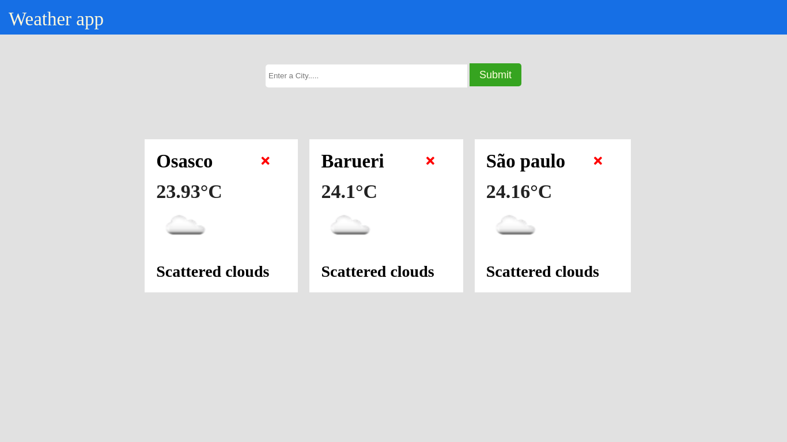

<p align="center">
  
</p>
<h1 align='center'>🚀 A Weather app 🚀 </h1>
An application django/python, used the API site https://openweathermap.org/, we can search any city in the world and find out how the weather is there.
<h2>Layout</h2>
  
<h2>How to run this repo: 🚀</h2>

```bash

# Clone this repo
$ git clone git@github.com:SMarkus27/Weather_App.git

# Open the project folder in the terminal/cmd
$ cd Weather_App

# Open the weather_app folder
$ cd weather_app

# Run the command to create a virtualenv:
$ python -m pip venv weather

# Activate the venv:
$ source weathero/bin/activate

# Install all dependencies in the requeriments.txt file.
$ pip install -r requeriments.txt

# Run the command to activate the application:
$ python manage.py runserver

# The server starts at the port:8000 - go to http://127.0.0.1:8000 

```

<h2>Tech Stack:</h2>
<ul>
  <li>HTML5</li>
  <li>CSS3</li>
  <li>Django/Python</li>
  <li>JSON</li>
  <li>API</li>
  <li>SQLite</li>
  
</ul>
 📝 License

This project is under license [MIT](./LICENSE).

Made by Marcus Vinicius 👋🏽 [Get in touch!](https://www.linkedin.com/in/marcus-vinicius-campos=pereira)
